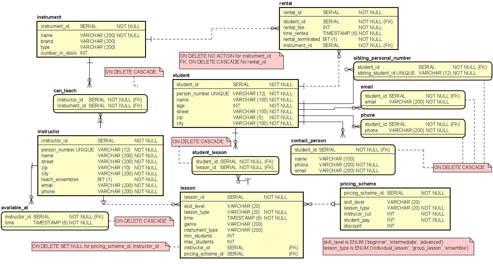

# iv1351-soundgood

A sample PostgreSQL database with a Java application following the MVC pattern.

## Logical Data Model
The SQL database has been created based on the structure seen in the logical model below.

<kbd>
  
</kbd>
